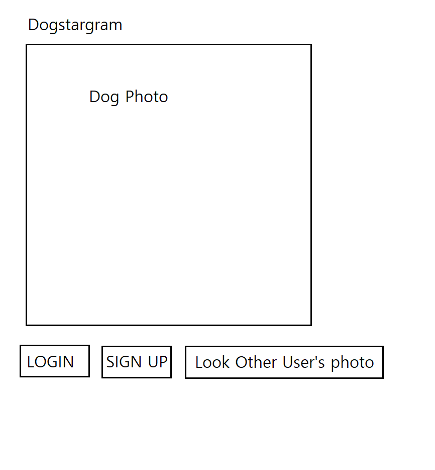

The content below is an example project proposal / requirements document. Replace the text below the lines marked "__TODO__" with details specific to your project. Remove the "TODO" lines.

(___TODO__: your project name_)

# Dogstargram

## Overview

(___TODO__: a brief one or two paragraph, high-level description of your project_)

Recently, social midea is getting more and more popular. Many people are sharing their photos about their life. There is a trend that many dog owner make their dog's instragm page to show their own dogs. 

Dogstargram is a web app that will allow users to share their dogs photos or any kind of dogs photos. User can register and login.
Once they are logged in, they can upload their dog's image url or they can search any doags images and upload dogs' image url. When they make
album, they can check share or not share. If they upload image url to share album list, other people also can see their photo in share page photo! 
In their own page, they can filter their own photos by name or date and they also can filter their album by names or date. 


## Data Model

(___TODO__: a description of your application's data and their relationships to each other_) 

The application will store Users, photo urls.


* User has userid, password, email.
* Album has userid by ref (Object id of user)
* Album has date, photo list url, name of album, share check


(___TODO__: sample documents_)

An Example User:

```javascript
{
  userid: kwangi92,
  password: password hashed,
  email: kwangi92@gamil.com
  list: [ album object id]
}
```

An Example Album with Embedded Items:

```javascript
{
  user: user model's object id,
  name: Haru, 
  photos: [https://previews.123rf.com/images/5second/5second1706/5second170600364/80205522-beautiful-black-shiba-inu-dog.jpg]
  date: 2010-11-22,
  share: yes
}
```


## [Link to Commented First Draft Schema](db.js) 

(___TODO__: create a first draft of your Schemas in db.js and link to it_)

## Wireframes

(___TODO__: wireframes for all of the pages on your site; they can be as simple as photos of drawings or you can use a tool like Balsamiq, Omnigraffle, etc._)


/ - main page you can login, signup, look others photo



/login - login page


/signup -register page


/home - user's album list page


/home/createalbum - create album


/home/:id/ -user's photolist in specific album


/home/:id/add - upload dog's image url into the album


/others - you can see other people's shared photo


## Site map

(___TODO__: draw out a site map that shows how pages are related to each other_)


## User Stories or Use Cases

(___TODO__: write out how your application will be used through [user stories](http://en.wikipedia.org/wiki/User_story#Format) and / or [use cases](https://www.mongodb.com/download-center?jmp=docs&_ga=1.47552679.1838903181.1489282706#previous)_)

1. as non-registered user, I can register a new account with the site or I can see other shared dog photo without login
2. as a user, I can log in to the site
3. as a user, I can create a new albums
4. as a user, I can view all of the album lists I've created
5. as a user, I can filter with name or date to see seecific album list
6. as a user, I can upload photo url to album
7. as a user, I can see the photo list that is in the specific album
8. as a user, I can filter with name or date to see specific photos in the album
9. as a user, I can see other user's shared photo. 

## Research Topics

(___TODO__: the research topics that you're planning on working on along with their point values... and the total points of research topics listed_)

* (5 points) Integrate user authentication
    * I'm going to be using passport for user authentication
    * Adding for register page
    * Adding for login page
    * used passport-local module
* EJS
    * to render page, instead of hbs I used ejs
* Extra module that we have not learned
    * crypto - I used for hash password
    * flash - To show user id already exit or not. To show user login fail

10 points total out of 8 required points (___TODO__: addtional points will __not__ count for extra credit_)


## [Link to Initial Main Project File](/app.js) 

(___TODO__: create a skeleton Express application with a package.json, app.js, views folder, etc. ... and link to your initial app.js_)

## Annotations / References Used

(___TODO__: list any tutorials/references/etc. that you've based your code off of_)


1. [crypto, passport and flash](https://miryang.dev/2019/04/11/nodejs-page-2/) - check comment in app.js
2. [ejs](https://ejs.co/) - basic templete

